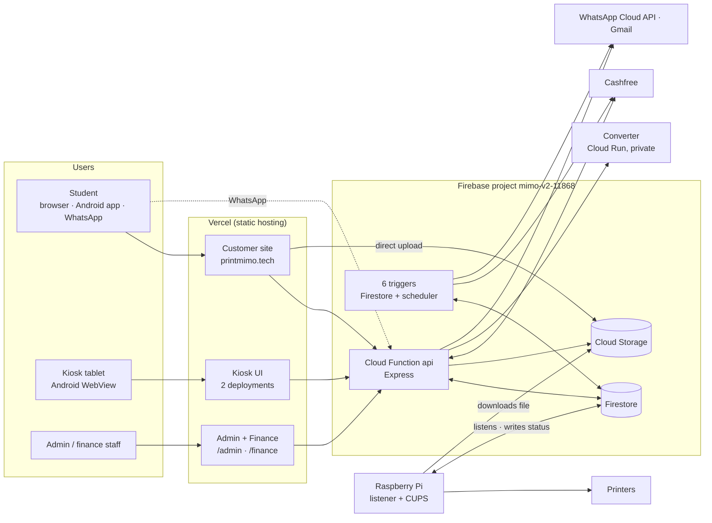
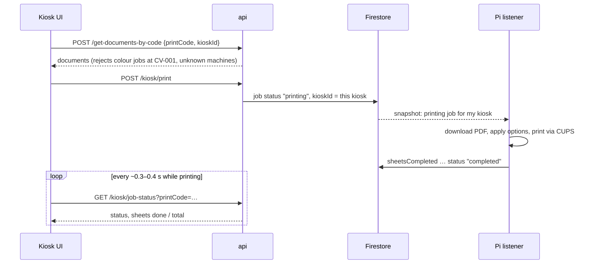

# MIMO — Architecture

> How MIMO is built, why it is built that way, and where to look when something breaks.
> Setup and commands live in the [root README](README.md) and in the README of each folder; the reasoning behind conventions is in [`design.md`](design.md); deployment is in
> [`docs/deployment/CI_CD.md`](docs/deployment/CI_CD.md). New here? Start with [`docs/onboarding.md`](docs/onboarding.md).

**Contents** — [1 Overview](#1-overview) · [2 System context](#2-system-context) · [3 Components](#3-components) ·
[4 Key flows](#4-key-flows) · [5 Data model](#5-firestore-data-model) · [6 Backend](#6-backend-design) ·
[7 Security](#7-security-model) · [8 Admin & finance analytics](#8-admin--finance-analytics) ·
[9 Raspberry Pi](#9-raspberry-pi-and-kiosk-hardware) · [10 Deployment](#10-deployment-topology) ·
[11 Failure modes](#11-failure-modes-and-what-you-see) · [12 Design decisions](#12-design-decisions) ·
[13 Limitations](#13-known-limitations) · [14 Feature status](#14-feature-status-and-unverified-behaviour)

---

## 1. Overview

MIMO is a self-service printing network for campuses. A student uploads a document on the website, pays, and receives a
**4-digit print code**. At a kiosk they type the code and the document prints — no USB drives, no queue, no staff.

| Fact | Value |
|---|---|
| Machines in production | 2 — **MIMO 1.0** `CV-001` (B&W), **MIMO 2.0** `SV-002` (B&W + colour) |
| Backend | One Firebase Cloud Function `api` (Express) + 6 Firestore/scheduler triggers, project `mimo-v2-11868` |
| Database / files | Firestore + Cloud Storage |
| Payments | Cashfree (UPI/cards), automatic refunds on failed prints |
| Clients | Customer web app (+ Android wrapper), kiosk touchscreen UI, admin dashboard, finance portal, WhatsApp bot |
| Hardware link | **Pull model**: each Raspberry Pi watches Firestore; nothing ever connects *to* a Pi |

Principles that shape everything below:

1. **Firestore is the single source of truth.** A print job is one document; every component reads or advances its `status`.
2. **Pull, don't push.** The API changes a document; the Pi that owns that kiosk reacts. No tunnels, no open ports on the Pis, prints survive restarts.
3. **One backend.** All server logic lives in `functions/`. `backend/` is legacy and frozen.
4. **Deployment names are contracts.** Function names, URLs, folder names and env-variable names are wired into external dashboards (Vercel, Firebase) that this repository cannot change.

## 2. System context



## 3. Components

| Component | Folder | Stack | Responsibility |
|---|---|---|---|
| **Backend** | `functions/` | Node 20, Express 5, Firebase Functions v2 | Auth, upload finalising, pricing, payments, print codes, kiosk contract, refunds, admin analytics, WhatsApp bot, e-mail |
| **Customer site** | `mimo-website/` | React 18, Vite, Tailwind 4, Capacitor | Login, upload, options, payment, print code; static marketing/legal pages; Android wrapper |
| **Admin + Finance** | `mimo-website/mimo-admin-dashboard/` | React 18, Vite, Recharts | Live, date-filtered operations and money dashboards; one bundle, two portals |
| **Kiosk UI** | `mimo-frontend-web-app/mimo-frontend/` | React 19, Vite | Code entry, live print progress, result, screensaver |
| **Kiosk shell** | `LENOVO TABLET APP/` | Kotlin WebView | Locks the tablet to the kiosk page (Device Owner) |
| **Pi listener** | `pi-listener/`, `pi_scripts/` | Python, firebase-admin, CUPS | Executes prints, reports progress, sends heartbeat |
| **Converter** | `converter/` | Node + LibreOffice, Cloud Run | Office → PDF; private, protected by IAM and a shared secret |
| **Legacy backend** | `backend/` | Express | **Frozen**, not in the production path |

Repository layout, run commands and per-folder details: [root README](README.md).

## 4. Key flows

### 4.1 From upload to print code

```mermaid
sequenceDiagram
  participant S as Student (site)
  participant ST as Cloud Storage
  participant API as api
  participant FS as Firestore
  participant CF as Cashfree
  S->>ST: upload file directly
  S->>API: POST /finalize-upload
  API->>API: verify file, convert Office→PDF, count pages
  API->>FS: print_jobs/{id} status "pending"
  S->>API: POST /create-order (options, coupon, coins)
  API->>API: price = pages × rate, − coupon, − coins (1 coin = ₹0.50)
  alt total is ₹0 (free / fully discounted)
    API->>FS: orders/{id}, job "paid", printCode
  else payment needed
    API->>CF: create payment session
    S->>CF: pay
    CF->>API: POST /cashfree-webhook (server-to-server; verification being hardened, see 4.5 and 13)
    API->>FS: payment_transactions, job "paid", printCode
  end
  API-->>S: print code (on screen; also WhatsApp / e-mail where used)
```

### 4.2 At the kiosk



### 4.3 Job status lifecycle

```
pending ──payment──► paid ──kiosk print──► printing ──► completed
   │                                          └──────► failed ──► refunded (automatic)
   └─ superseded by a newer cart / never paid ─► abandoned   (upload flow + hourly cleanup)
```

* A failed print (the Pi reports `failed`) triggers **`autoRefundJob`** → Cashfree refund → status `refunded`; the kiosk shows the refund banner.
* Completed jobs get their files deleted (**`autoCleanupStorageJob`**); anything older than 24 h is swept hourly.
* Colour jobs are accepted only at `SV-002`; valid machines are `CV-001` and `SV-002`.

### 4.4 WhatsApp ordering
`/whatsapp-webhook` (Meta verify token + inbound messages) drives a small per-user state machine stored in `whatsapp_sessions`
(`idle → awaiting_coupon → …`). It reuses the same pricing/order code, sends a payment link (`/wa-pay/:orderId`) and, after
payment (`/wa-pay-success/:orderId`), the print code. `whatsapp_msg_ids` de-duplicates Meta's retries.

### 4.5 Payment and Cashfree webhook flow

Status: **implemented** (order creation, hosted checkout, `/verify-payment`, free/coupon orders); **partially implemented** (webhook — see below).

1. `POST /create-order` (customer JWT): merges the user's pending jobs into one job, prices it (`pricePerPage` from settings × pages), then applies the coupon percentage and coins (1 coin = ₹0.50).
   * payable amount **below ₹1** → free order: the job becomes `paid`, a random 4-digit print code is generated immediately, an `orders` record is written and a receipt e-mail is sent (no gateway involved);
   * otherwise a Cashfree order is created (`return_url` = `https://printmimo.tech/payment-verify?order_id=…`), a `payment_transactions` record with status `INITIATED` is stored, and `{ orderId, paymentSessionId, amount }` is returned to the browser.
2. The student pays on Cashfree's hosted checkout and is redirected to `/payment-verify`.
3. The website calls `GET /verify-payment/:orderId`. The API asks Cashfree for the order status **server-to-server**; if it is `PAID` it marks the order `PAID` and calls its own `/payment-success`, which assigns the **4-digit print code** to the jobs and returns it. If the Cashfree call fails it falls back to the status stored in Firestore.
4. In parallel Cashfree posts a webhook to `POST /cashfree-webhook`. On `PAYMENT_SUCCESS_WEBHOOK` the handler marks orders/jobs paid, calls `/payment-success` if no code exists yet and updates `users.totalSpent` and the `system/metrics` document.
   **Known issues:** the webhook path is only partially implemented. Its verification and response handling are being hardened (a fix is prepared, not deployed), and only the webhook — not `/verify-payment` — updates `totalSpent` and `system/metrics`, so those counters can lag. Do not rely on them; the dashboards compute their numbers from `orders` / `payment_transactions` (§8).
5. Failed prints are refunded by `autoRefundJob` (Cashfree refund API) and recorded in `refunds`; customers can also file `POST /request-refund`, which an admin resolves with `POST /admin/refund`.

## 5. Firestore data model

| Collection | Purpose | Key fields |
|---|---|---|
| `users/{uid}` | Customer accounts | `email`, `username`, `mimo_coins{balance,total_earned,total_used}`, `createdAt` |
| `print_jobs/{id}` | One document per print job | `userId`, `orderId`, `status`, `printCode`, `kioskId`, `printOptions{colorMode,duplex,copies,…}`, `pages`, `files[]`, `createdAt`, `sheetsCompleted`, `totalSheets`, `printerStatus` |
| `payment_transactions/{id}` | Cashfree payments — **source of real revenue** | `orderId`, `amount`, `status`, `paymentMethod`, `refundStatus`, `createdAt` |
| `orders/{id}` | Order records incl. free / discounted orders | `orderId`, `amount`, `status`, `discount`, `couponCode` |
| `refunds`, `refund_requests` | Completed refunds; customer requests awaiting an admin | `orderId`, `amount`, `status`, `reason` |
| `coupons/{code}` | Discount codes | `type`, `value`, `active` |
| `mimo_settings/{doc}` | Pricing and screensaver config | e.g. `screensaver` |
| `system_status/{kioskId}` | **Pi heartbeat**, one document per machine | `lastSeen`, `printerStatus` |
| `hardware/printers` | Paper / toner levels per machine | per-kiosk paper and supply |
| `rate_limits/{scope}_{hash}` | Failed print-code lookups per client | counters, `expireAt` |
| `whatsapp_sessions`, `whatsapp_msg_ids` | Bot state and de-duplication | |

Older documents may lack newer fields; readers (including the analytics code) tolerate that. Firestore **rules and indexes** are in
`backend/` (`firestore.rules`, `firestore.indexes.json`) and are not deployed by CI.

## 6. Backend design

```
functions/
├── index.js                 exports only: api + 6 triggers   (names are a deployment contract)
└── src/
    ├── server.js            Express app: CORS, body parsing, routers
    ├── config/              firebase.js (admin init) · env.js (reads process.env once)
    ├── middleware/          auth.js (customer / admin JWT) · rateLimit.js
    ├── routes/              URL → controller only
    ├── controllers/         HTTP in/out, one file per area (+ adminInsights)
    ├── services/            reusable logic: analytics, converter, whatsapp, email, pdf, storage, printJob
    ├── triggers/            Firestore + scheduler functions
    └── validators/          kiosk request / response / state-transition contract
```

**Route groups** (authoritative list: `functions/src/routes/`): Auth · Profile · Upload · Payment · Print-code & kiosk · Public · WhatsApp · Admin. Full table in
[`functions/README.md`](functions/README.md#3-api-overview).

**Triggers** (all in `functions/src/triggers/`):

| Function | Fires on | Does |
|---|---|---|
| `autoRefundJob` | `print_jobs` → `failed` | Refund via Cashfree |
| `autoCleanupStorageJob` | `print_jobs` → `completed` | Delete uploaded files |
| `sendFailureNotification` | `print_jobs` → `failed` | Alert e-mail |
| `colourPaperUsageNotification` | `print_jobs` → `completed` | Colour paper usage e-mail |
| `printerHardwareNotification` | `hardware/printers` updated | E-mail when a printer reports a problem |
| `scheduledFileRetentionCleanup` | hourly (Asia/Kolkata) | Remove files older than 24 h |

**Print-code protection.** A 4-digit code has only 10 000 values, so the endpoints that accept one (`/get-documents-by-code`,
`/kiosk/print`, `/kiosk/job-status`) run through `middleware/rateLimit.js`: failed lookups (404/409) are counted per client
IP in Firestore, shared by all instances — 5/min + 20/h for code entry, 20/min + 100/h for status polling. Over the limit → `429` +
`Retry-After`. It fails open if Firestore is unreachable so a database hiccup cannot lock every kiosk.

## 7. Security model

| Concern | How it is handled |
|---|---|
| Customer identity | JWT (`userId`, 30 days) from `/login`, `/register`, `/google-login` |
| Admin / finance identity | `POST /admin/login` compares against `ADMIN_EMAIL` / `ADMIN_PASSWORD`; JWT with `isAdmin`, 24 h; login disabled if unset. Dashboards drop the token on any `401`. |
| Role separation | Customer tokens are rejected on `/admin/*`; the admin app never sends the customer token |
| Kiosk endpoints | Unauthenticated by design (a student types a code) → rate-limited and validated against a contract |
| Pi → API | `/kiosk/report-failure` requires `INTERNAL_WEBHOOK_SECRET`; the Pi itself uses a Firebase service-account key |
| Payments | The payment result is confirmed server-to-server with Cashfree in `/verify-payment`. The Cashfree webhook is **partially implemented**: its hardening is in progress (see §4.5 and §13) |
| Converter | Private Cloud Run service (IAM) + `INTERNAL_CONVERTER_SECRET` |
| Secrets | Only in env variables and git-ignored files. CI builds `functions/.env` at deploy time and refuses insecure values (default admin password, weak/public `JWT_SECRET`) |
| Ownership | `/mark-printed` only touches the caller's own jobs |

## 8. Admin & finance analytics

Numbers are computed **server-side** (`services/analytics.service.js`, served by `controllers/adminInsights.controller.js`); the
dashboards only render them.

```
Browser (range picker) ── from, to, tzOffset ──► parseRange (validate, ≤ 400 days)
                                                 loadWindow: range queries on orders, payment_transactions,
                                                             print_jobs, refunds, users
                                                 normalize (merge orders ∪ payments by orderId) → summarize · buildSeries · breakdowns
charts, KPIs, deltas ◄── { current, previous, series, byKiosk, byPaymentMethod, byStatus, modes, byHour }
```

* **Range:** ISO `from` (inclusive) / `to` (exclusive) plus `tzOffset` (minutes ahead of UTC; IST = 330). Default = today. ≤ 2 days → hourly buckets, otherwise daily; series are gap-free.
* **Comparison:** `compare=1` runs the same maths on the preceding window of equal length.
* **Revenue** = orders `PAID`/`SUCCESS`/`REFUNDED` (Cashfree from `payment_transactions`, free from `orders`, no double counting). **Refunds** = `refundStatus == SUCCESS`, `REFUNDED`, or a `refunds` document. **Net** = revenue − refunds.
* **Machines:** `CV-001` and `SV-002` are always listed; *online* = heartbeat within 5 min; paper < 15 % / toner < 20 % counts as low.
* **Live:** the UI polls every 30 s while the range includes today (only while the tab is visible).
* **No composite indexes:** single-field range/equality queries plus in-memory filtering; capped at 5 000 documents per collection (`truncated: true`). This is deliberate — creating indexes needs console access.

### 8.1 Admin and Finance workflows

Status: **implemented**. Two portals, one bundle (`mimo-website/mimo-admin-dashboard`), one login (`POST /admin/login`, 24 h JWT).

| Portal | URL | Typical tasks | Endpoints used |
|---|---|---|---|
| Admin | `/admin/` | Watch machines (online, paper, toner), incidents (offline machines, failed prints, refund requests), print jobs, customers, screensaver/config | `/admin/analytics`, `/kiosks`, `/incidents`, `/jobs`, `/users`, `/hardware`, `/screensaver` |
| Finance | `/finance` | Revenue and net revenue, transactions, refunds (approve/reject), pricing and coupons, wallet (customer coins), period reports | `/admin/analytics`, `/transactions`, `/refund-requests`, `/refund`, `/settings`, `/coupons`, `/users` |

Both use a shared date-range picker (default: today) and poll every 30 s while the range includes today. A separate finance-only login exists in the code
(`FINANCE_EMAIL` / `FINANCE_PASSWORD`) but is **partially implemented**: its token cannot yet call the `/admin/*` endpoints, so finance staff currently use the admin login.
"Settlements" and "Wallet" screens are derived from order and user data; there is no bank-settlement integration (**planned**, not implemented).

## 9. Raspberry Pi and kiosk hardware

| | MIMO 1.0 (`CV-001`) | MIMO 2.0 (`SV-002`) |
|---|---|---|
| Printers | Brother HL-L5210DN (B&W) | Brother HL-L2440DW (B&W) + Epson L3250 (colour) |
| Service | `mimo-listener` (systemd), `KIOSK_ID=CV-001` | `mimo-listener`, `KIOSK_ID=SV-002` |

The listener (Python, one process per Pi):
1. subscribes to `print_jobs` where `status == "printing"` for its `KIOSK_ID`;
2. downloads the file(s), converts locally if needed (HEIC, Office), applies options (colour/B&W, duplex, copies, N-up, page ranges) and prints via CUPS;
3. writes `sheetsCompleted`, then `completed` or `failed` (+ reason); the `pi_scripts` variant also calls `POST /kiosk/report-failure` on failure;
4. every ~30 s writes `system_status/<KIOSK_ID>` (`lastSeen`, `printerStatus` from `lpstat`) and pings the API root.

The Pi holds a Firebase **service-account key** (full Firestore access) — treat the SD card as a secret. Systemd units and setup helpers: `scripts/pi-setup/`.
**Two listener variants exist** and both were edited in September 2026: `pi_scripts/firebase_listener.py` (≈1 650 lines; colour-sheet accounting, `report-failure` call) and `pi-listener/firebase_listener.py` (≈980 lines; the MIMO 2.0 work: physical paper/printer error detection and a 120 s print deadline, per its commit message). Which file runs on which Pi is **unverified** — the deployment scripts in `scripts/pi-ops/` push `pi_scripts/…` to both machines. Compare the file on the device with both variants before deploying.

## 10. Deployment topology

| Part | Where | Deployed by |
|---|---|---|
| API | Firebase Functions, `us-central1` | GitHub Action on push to `main` touching `functions/**` (with a config/security gate and smoke test) |
| 6 triggers | Firebase Functions — live regions differ (`asia-south1` for 4 of them) | Manual opt-in via the same workflow; the code sets no region, so a blind deploy would create duplicates (see `CI_CD.md` §6) |
| Customer site + admin + finance | Vercel `mimo_v2` → `printmimo.tech` | Vercel Git integration; `vercel.json` rewrites `/admin*`, `/finance*` to the admin bundle |
| Kiosk UI (×2) | Vercel (two projects) | Vercel Git integration |
| Converter | Cloud Run `mimo-office-converter` | GitHub Action on push touching `converter/**` |
| Legacy backend | Northflank + GHCR image | Frozen |
| Pis, tablets, Firebase rules | Devices / Firebase | **Manual** |

Vercel, Firebase and Google Cloud settings are not stored in this repository, which is why folder names, `firebase.json`,
`.firebaserc` and exported function names must not change. Details, secrets and rollback: [`CI_CD.md`](docs/deployment/CI_CD.md).

## 11. Failure modes and what you see

| Failure | Symptom | Where to look / what happens |
|---|---|---|
| Pi offline / listener stopped | Machine shows *offline* on the dashboard; jobs stay `printing` | `journalctl -u mimo-listener`; once the Pi (or the kiosk's `report-failure` call) marks the job `failed`, it is refunded |
| Printer jam / out of paper | Job `failed`, refund banner on kiosk, alert e-mail | CUPS state, `hardware/printers` |
| Wrong code entered repeatedly | `429` "Too many attempts" at the kiosk | Rate limiter; wait for `Retry-After` |
| Payment succeeded but no code | Order in `payment_transactions` without a `paid` job | `/verify-payment` logs (`[VERIFY-PAYMENT]`), Cashfree dashboard |
| API unreachable | Dashboards show an error banner with *Retry*; kiosk retries every 2 s | Function logs, Cloud Run status |
| Converter down | Office uploads fail; PDFs/images still work | Converter health, IAM invoker |
| Firestore unavailable | Rate limiter fails open; most operations error | Firebase status |

## 12. Design decisions

| Decision | Why |
|---|---|
| Firebase Functions + Firestore, no servers to run | Free tier covers current scale; no VPS or tunnel to maintain |
| Pull-based Pis | Works behind any network, survives reboots, no inbound access needed |
| Direct browser → Storage uploads | Large files never pass through the API |
| One shared rate limiter in Firestore | In-memory limits are per instance and useless on serverless |
| Analytics on the server | One definition of "revenue"; the dashboards cannot disagree |
| Admin and Finance as one bundle, two entry paths | One build, one deployment, one login; separate UIs |
| Docs and code keep legacy `backend/` | An external process may still use its image; deleting is irreversible |

## 13. Known limitations

* `POST /payment-success` trusts the caller instead of confirming with Cashfree.
* **Cashfree webhook handling is partially implemented and is being hardened** (a fix is prepared but not deployed; details are withheld from this public repository until it is live). `/verify-payment` is the authoritative payment check today.
* CORS allows any origin; `storage.rules` currently allows public read/write; Firestore rules are managed outside `functions/`.
* Admin uses one shared login (`ADMIN_EMAIL` / `ADMIN_PASSWORD`) — no per-user accounts or audit trail.
* Rate limiting is per IP: everyone at one kiosk shares a budget, so a run of wrong codes can briefly lock that kiosk.
* Analytics read up to 5 000 documents per collection per request; pre-aggregate daily totals at much larger scale.
* Pi listeners, tablets and Firebase rules are deployed by hand; two listener copies exist and the live one per machine is unconfirmed.
* `company-website/` and the in-app legacy admin page (`mimo-website/src/app/pages/mimo-admin-dashboard/`) are stale copies.

## 14. Feature status and unverified behaviour

Legend: **Implemented** = present in code and exercised in production or tests · **Partial** = present but incomplete or being fixed · **Planned** = not in the code · **Unverified** = present in the code, not confirmed by this documentation audit.

| Area | Feature | Status |
|---|---|---|
| Customer | Sign-up/login (e-mail, Google), profile, coins | Implemented |
| Customer | Upload (PDF, images, Office), text-to-PDF, print options, coupons | Implemented |
| Customer | Cashfree checkout, print code, print history, refund requests | Implemented |
| Customer | WhatsApp ordering | Implemented; end-to-end flow **unverified** by this audit |
| Customer | Android app (Capacitor wrapper of the website) | Implemented; build and store release **unverified** |
| Kiosk | Code entry, live progress, refund banner, screensaver, maintenance screen | Implemented |
| Kiosk | Android lock-task shell | Implemented; device setup is manual |
| Backend | Rate limiting, auto refunds, storage retention, alert e-mails | Implemented |
| Backend | Cashfree webhook | **Partial** — hardening in progress |
| Backend | Separate finance login | **Partial** |
| Backend | Per-user admin accounts, audit trail | **Planned** |
| Dashboards | Live analytics, date ranges, machines, incidents, transactions, refunds, pricing/coupons | Implemented |
| Dashboards | Bank settlement reconciliation | **Planned** (screen shows order-derived figures) |
| Data | BigQuery export proposed in `docs/architecture/FIREBASE_SCHEMA_DESIGN.md` | **Planned** |
| Hardware | Pi listeners, heartbeat, CUPS printing | Implemented; live file per machine **unverified** |
| Ops | Push-to-deploy for `api`, converter, web apps | Implemented; triggers, Pis, tablets and Firebase rules are manual |
