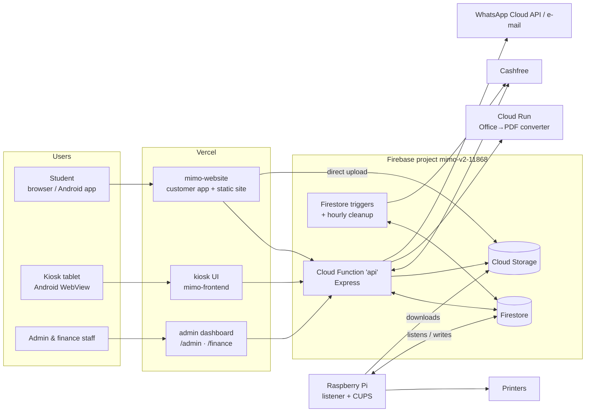
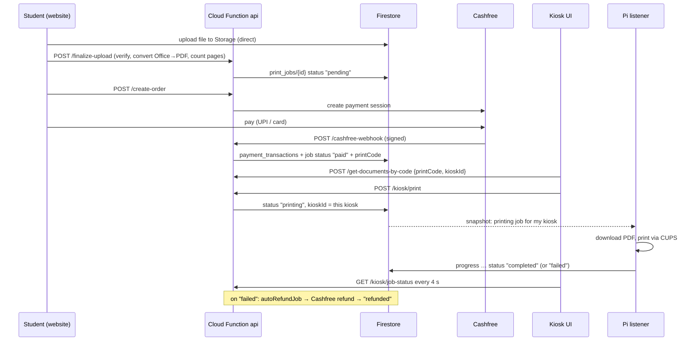

# MIMO — System Architecture

This document explains **how the whole system fits together**: the components, how a print travels through them, what is
stored where, how the dashboards compute their numbers, and what to be careful about. For setup and day-to-day
commands see the [root README](../../README.md) and the README inside each folder.

Contents: [1 Context](#1-system-context) · [2 Components](#2-components) · [3 A print, end to end](#3-a-print-end-to-end) ·
[4 Data model](#4-firestore-data-model) · [5 API & auth](#5-api-and-authentication) · [6 Triggers](#6-background-triggers) ·
[7 Analytics](#7-admin--finance-analytics-design) · [8 Rate limiting](#8-print-code-protection) · [9 Raspberry Pis](#9-raspberry-pi-listener) ·
[10 Deployment](#10-deployment-topology) · [11 Security](#11-security-model) · [12 Limitations](#12-known-limitations)

---

## 1. System context



Design principle: **the Pis pull, nothing pushes to them.** The API never needs to reach a printer; it only changes a
Firestore document, and the Pi that owns that kiosk reacts. That removes tunnels/VPNs from the critical path and keeps
prints safe across restarts (state lives in Firestore).

## 2. Components

| Component | Folder | Tech | Responsibility |
|---|---|---|---|
| Backend | `functions/` | Node 20, Express 5, Firebase Functions v2 | All business logic: auth, upload finalising, pricing, Cashfree, print codes, kiosk contract, refunds, admin analytics, WhatsApp bot, e-mail |
| Customer site | `mimo-website/` | React 18, Vite, Tailwind 4, Capacitor | Login, upload, options, payment, print code; static marketing/legal pages |
| Admin & finance | `mimo-website/mimo-admin-dashboard/` | React 18, Vite, Recharts | Live operations and money dashboards (date-range driven) |
| Kiosk UI | `mimo-frontend-web-app/mimo-frontend/` | React 19, Vite | Code entry, live progress, results, screensaver |
| Kiosk shell | `LENOVO TABLET APP/` | Kotlin WebView | Locks the tablet into the kiosk page |
| Pi listener | `pi-listener/`, `pi_scripts/` | Python, firebase-admin, CUPS | Print execution + heartbeat |
| Converter | `converter/` | Node + LibreOffice on Cloud Run | Office → PDF (private, shared-secret protected) |
| Legacy backend | `backend/` | Express | **Frozen**, not production |

Backend layering (`functions/src`): `routes` (URL → handler) → `controllers` (HTTP in/out) → `services` (reusable logic) →
`config` (Firebase, env). `middleware` holds auth and rate limiting, `validators` holds the kiosk request/state contract,
`triggers` holds Firestore/scheduler functions. `functions/index.js` only exports.

## 3. A print, end to end



Job status lifecycle (`print_jobs.status`):

```
pending ──pay──► paid ──kiosk print──► printing ──► completed
                   │                       └──────► failed ──► refunded (automatic)
                   └── superseded by a newer cart / never paid ─► abandoned (upload flow + hourly retention job)
```

Rules enforced at `POST /get-documents-by-code` / `POST /kiosk/print`: a `kioskId` is required; **colour jobs are only
accepted at `SV-002`**; only `CV-001` / `SV-002` are valid machines; a job already printing elsewhere is rejected.

Free orders (100 % coupon or coins) skip Cashfree: they are stored in `orders` and go straight to `paid`.

## 4. Firestore data model

| Collection | Purpose | Key fields |
|---|---|---|
| `users/{uid}` | Customer accounts | `email`, `name`, `mimo_coins{balance,total_earned,total_used}`, `createdAt` |
| `print_jobs/{id}` | One document per print job | `userId`, `orderId`, `status`, `printCode`, `kioskId`, `printOptions{colorMode,duplex,copies,…}`, `pages`, `files[]`, `createdAt`, `progress`, `failureReason` |
| `payment_transactions/{id}` | Cashfree payments (**source of real revenue**) | `orderId`, `amount`, `status` (`SUCCESS`…), `paymentMethod`, `refundStatus`, `createdAt` |
| `orders/{id}` | Order records incl. **free/discounted** orders | `orderId`, `amount`, `status` (`PAID`/`REFUNDED`…), `discount`, `couponCode` |
| `refunds/{id}`, `refund_requests/{id}` | Completed refunds; customer requests awaiting admin | `orderId`, `amount`, `status`, `reason` |
| `coupons/{code}` | Discount codes | `type`, `value`, `active`, `usageLimit` |
| `mimo_settings/{doc}` | Pricing, screensaver config | e.g. `screensaver` |
| `system_status/{kioskId}` | **Pi heartbeat** (one doc per machine) | `lastSeen`, `printerStatus` |
| `hardware/printers` | Paper / toner levels per machine | `<kioskId>.paper`, `.supply` … |
| `rate_limits/{scope}_{hash}` | Failed-code counters | `count`, window timestamps |
| `whatsapp_sessions`, `whatsapp_msg_ids` | WhatsApp bot state / de-duplication | |
| `printer_usage`, `system` | Usage counters, misc system docs | |

Not every field above exists on every document (older documents pre-date some fields); the analytics code tolerates
missing fields. **Firestore rules/indexes live in `backend/` files** (`backend/firestore.rules`, `backend/firebase.json`)
and can only be deployed with console/CLI access.

## 5. API and authentication

* One HTTPS function `api` (`us-central1`) serving every route: <https://api-upqxuj7evq-uc.a.run.app>.
* **Customer routes** need `Authorization: Bearer <JWT>` (issued by `/login`, `/register`, `/google-login`).
* **Admin routes** (`/admin/*`) need an admin JWT (`isAdmin`) issued by `POST /admin/login`, which checks
  `ADMIN_EMAIL`/`ADMIN_PASSWORD`. Login is disabled when they are unset. The dashboards store the token as
  `adminToken` / `financeToken` and clear it on any `401`.
* **Kiosk routes** (`/kiosk/*`, `/get-documents-by-code`) are unauthenticated by design (a student types a code) and are
  protected by the rate limiter and by validators; `/kiosk/report-failure` requires `INTERNAL_WEBHOOK_SECRET`.
* **Webhooks** are authenticated by signature/secret (Cashfree) or verify token (WhatsApp).
* Full route table: [`functions/README.md`](../../functions/README.md#3-api-overview).

## 6. Background triggers

Defined in `functions/src/triggers/`, exported from `functions/index.js`. **CI deploys only `api`; deploy these manually.**

| Function | Fires on | Does |
|---|---|---|
| `autoRefundJob` | `print_jobs` updated → `failed` | Refunds via Cashfree, marks refunded |
| `autoCleanupStorageJob` | `print_jobs` updated → `completed` | Deletes the job's uploaded files |
| `sendFailureNotification` | `print_jobs` updated → `failed` | Alert e-mail |
| `printerHardwareNotification` | `hardware/printers` updated | E-mail alerts when a printer reports a problem status |
| `colourPaperUsageNotification` | `print_jobs` updated → `completed` | Colour paper usage alert e-mails |
| `scheduledFileRetentionCleanup` | Every hour (Asia/Kolkata) | Removes files older than 24 h with a recoverable lease |

## 7. Admin & finance analytics design

The dashboards are thin: **all numbers are computed server-side** by `functions/src/services/analytics.service.js` and served
by `controllers/adminInsights.controller.js`. The frontend only renders (`mimo-admin-dashboard/src/services/insights.service.ts`).

```
Browser (range picker)        API                                   Firestore
  from, to, tzOffset  ─────►  parseRange()  (validate, ≤400 days)
                              loadWindow()  ── range queries ─────►  orders, payment_transactions,
                              normalizeOrders/Jobs (merge by orderId) print_jobs, refunds, users
                              summarize · buildSeries · breakdowns
  charts, KPIs, deltas ◄────  { current, previous, series, byKiosk, … }
```

* **Date range.** The UI sends `from` (inclusive), `to` (exclusive) as ISO instants plus `tzOffset` (minutes ahead of UTC,
  IST = 330). Default = today. "Today", day buckets and hour-of-day all follow the *viewer's* calendar. A range up to 2 days
  gives hourly buckets, longer gives daily buckets; series are gap-free (empty buckets are zeros).
* **Comparison.** With `compare=1` the same maths runs for the equally long preceding window; the UI shows the % change.
* **Revenue** = orders in status `PAID`/`SUCCESS`/`REFUNDED` (Cashfree payments from `payment_transactions`, free orders from
  `orders`, merged by `orderId` so nothing is counted twice). **Refunds** = `refundStatus == SUCCESS`, status `REFUNDED`, or
  a `refunds` document. **Net** = revenue − refunds. **Success rate** = completed / (completed + failed) jobs.
* **Machines.** `CV-001` (MIMO 1.0) and `SV-002` (MIMO 2.0) are always listed. *Online* = `system_status/<id>.lastSeen`
  within 5 minutes. Paper is *low* under 15 %, toner/supply under 20 %. Any other `XX-000` id that sends a heartbeat is
  listed automatically; legacy docs (e.g. `system_status/pi`) are ignored.
* **Live.** While the range includes today the UI polls (default every 30 s, only while the tab is visible).
* **No composite indexes.** Every query is a single-field range/equality; extra filtering is in memory (each collection capped
  at 5 000 docs per query → `truncated: true`). This is deliberate: creating indexes needs console access.
* **Tested** in `functions/__tests__/analytics.test.js` (bucketing, IST edges, dedupe, refunds, per-kiosk maths).

## 8. Print-code protection

Print codes have only 10 000 possibilities, so `/get-documents-by-code`, `/kiosk/print` and `/kiosk/job-status` are wrapped by
`middleware/rateLimit.js`. It counts **failed** lookups (404/409) per client IP hash in Firestore (`rate_limits`), so the limit
is shared by all function instances: 5/min + 20/h for code entry, 20/min + 100/h for status polling. Over the limit →
`429` + `Retry-After`. It **fails open** if Firestore is unreachable so a database hiccup can't lock every kiosk.

## 9. Raspberry Pi listener

One Python service per kiosk (`mimo-listener.service`, env `KIOSK_ID`, printer names). It:

1. subscribes (`on_snapshot`) to `print_jobs` where `status == "printing"` for its kiosk;
2. downloads the file(s) with the Firebase Admin key, converts locally if needed (HEIC, Office), applies the options
   (colour/B&W, duplex, copies, N-up, ranges) and prints via CUPS;
3. writes progress, then `completed` or `failed` (+ reason);
4. every ~30 s writes `system_status/<KIOSK_ID>` (`lastSeen`, `printerStatus` from `lpstat`).

The Pi holds a Firebase **service-account key** (full Firestore access, bypasses rules) — treat the SD card as a secret.

## 10. Deployment topology

| Part | Where | Trigger |
|---|---|---|
| API | Firebase Functions (`us-central1`, project `mimo-v2-11868`) | Push to `main` touching `functions/**` (`deploy-functions.yml` → `functions:api`) |
| Triggers | Firebase Functions | Manual `firebase deploy --only functions` |
| Customer + admin + finance | Vercel (`printmimo.tech`) | Push; `vercel.json` rewrites `/admin*`, `/finance*` to the admin bundle |
| Kiosk UI | Vercel (two deployments, one per machine URL) | Push |
| Converter | Cloud Run `mimo-office-converter` | Manual workflow `deploy-converter.yml` |
| Pi listeners | On the devices | Manual (`scripts/deployment/`) |

Vercel and Firebase Console settings are not stored in this repo — that is why folder names, `firebase.json`, `.firebaserc`
and exported function names must not change.

## 11. Security model

* Secrets are only in environment variables / git-ignored files (`functions/.env`, `serviceAccountKey.json`); the repo has none.
* Roles are separated by JWT claims (`isAdmin`); a customer token is rejected on admin routes; the admin dashboard never
  sends the customer token and vice versa.
* Ownership checks: `/mark-printed` only touches the caller's own jobs.
* Print-code guessing is rate-limited; kiosk state transitions are validated against a contract.
* The converter is private and requires `INTERNAL_CONVERTER_SECRET`.

## 12. Known limitations

* `POST /payment-success` trusts the caller instead of confirming the payment with Cashfree (payment webhook path is safe).
* CORS allows any origin; Firestore rules are not managed from `functions/`.
* Triggers are not part of CI; a forgotten manual deploy leaves old trigger code running.
* Analytics read up to 5 000 docs per collection per request — fine today, revisit (pre-aggregated daily docs) at much larger scale.
* Two Pi listener copies (`pi-listener/`, `pi_scripts/`) exist; which is live per machine must be confirmed on the devices.
* `company-website/` and `src/app/pages/mimo-admin-dashboard/` (in-app legacy admin) are stale copies.
